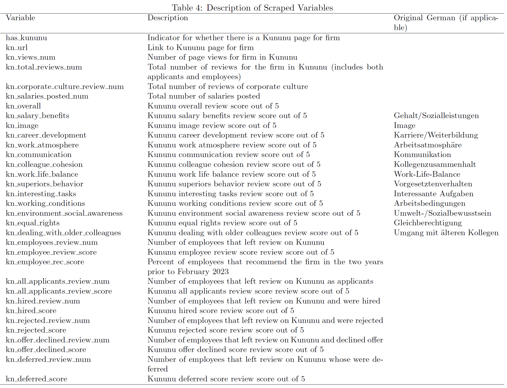

## Description
This repo provides Python code for webscraping Kununu, an employer review platform similar to Glassdoor with a strong presence in German-speaking countries. All 255,002 employer profiles as of December 15th, 2024 are scraped.

This code was developed for [Caldwell, Haegele, and Heining (2024)](https://sydneec.github.io/Website/CHH_Bargain.pdf). "Bargaining Power and Inequality in the Labor Market." (Revise and Resubmit, *Quarterly Journal of Economics*).

> **Important Notes:**
> - This code works as of December 15th, 2024, but Kununu's website may change. If element and class IDs are changed but the overall structure of the website remains similar, it may suffice to update the ```CSS_CLASSES``` dictionary in ```config.py```.
> - This code takes roughly 20 hours to run.
> - By default, this code does not use a proxy rotation service, which may result in IP blocks. See instructions below for using ScrapingBee to avoid this issue.

## Instructions for Running Code

1. Install required packages:
```pip install -r requirements.txt```

2. If using ScrapingBee:
- Create a ```.env``` file in the project root
- Add your ScrapingBee API key:  ```SCRAPINGBEE_API_KEY=your_api_key_here ```
- Uncomment the load_dotenv() line in both Jupyter notebooks
- In ```utils.py```, set the scrapingbee parameter to True when calling ```soup_from_url()```:
  ```python
  soup = soup_from_url(url, scrapingbee=True)
  ```

3. Run ```get_list_of_employer_profile_urls.ipynb```:
- This will scrape Kununu's sitemap to get all company profile URLs
- Output: ```data/all_kununu_company_profile_links.txt```

4. Run ```scrape_employer_profiles.ipynb```:
- This script scrapes detailed information from each company profile
- Adjust the ```CONCURRENCY``` variable if needed to change the number of pages that are scraped in parallel (default is 10)
- The script saves results in batches of 5000 profiles in case of interruptions
- Final output: ```data/kununu_data.csv```

5. Run ```scrape_reviews.ipynb```:
- This will scrape the text of all reviews for each employer
- Output: ```data/written_reviews.json```

## Computational Requirements

- Software: Python 3.12.0
- Required Python packages (see ```requirements.txt``` for exact versions used):
  - beautifulsoup4
  - numpy
  - pandas
  - python-dotenv
  - requests
  - multiprocessing
  - random
  - re
  - urllib
- Storage: At least 100MB of free space
- Execution time: Approximately 10 hours for full website scrape
- Memory: 8GB RAM was used for the original analysis

 A web scraping service is recommended to avoid IP blocks. The code supports ScrapingBee, but can run without it at a higher risk of being rate-limited.

## Description of Scraped Data
The varaibles collected are described in the table below:

# kununu_scrape
